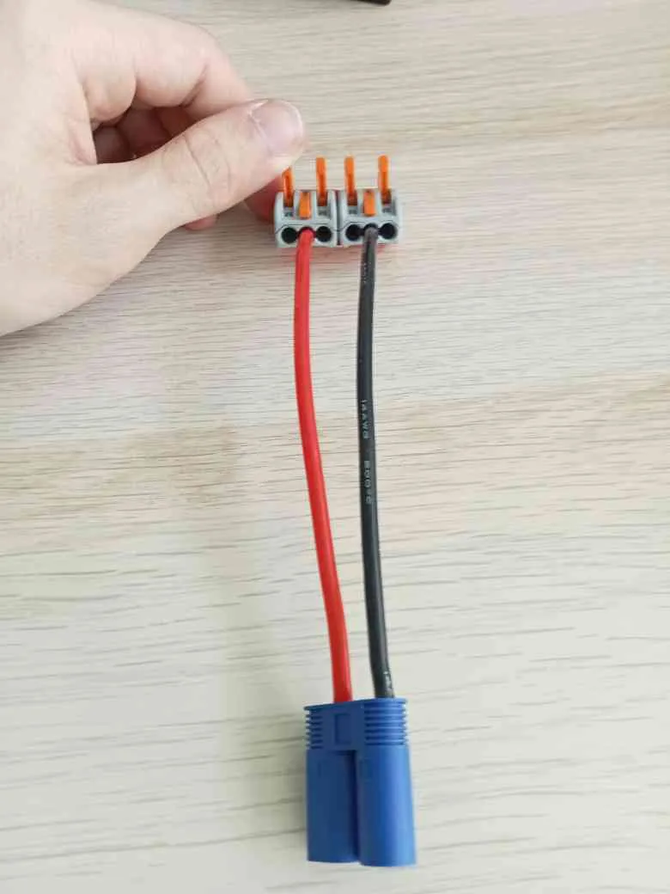
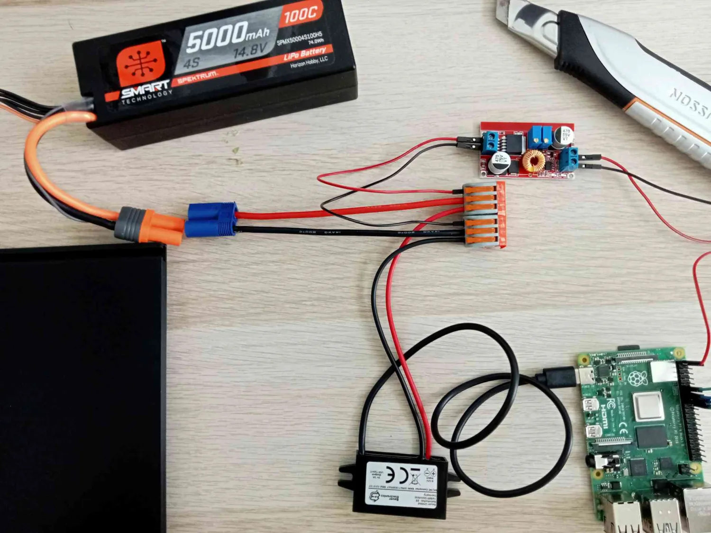
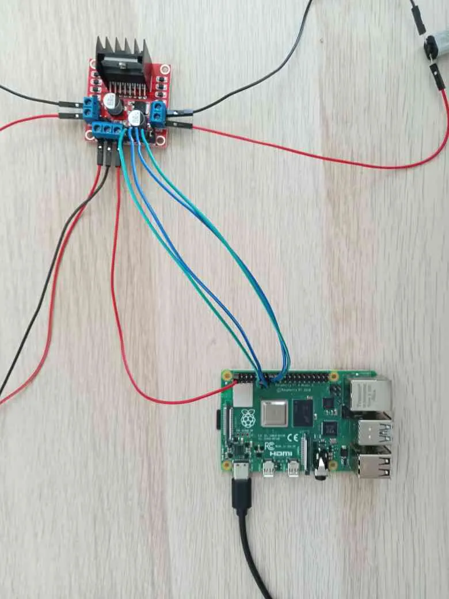
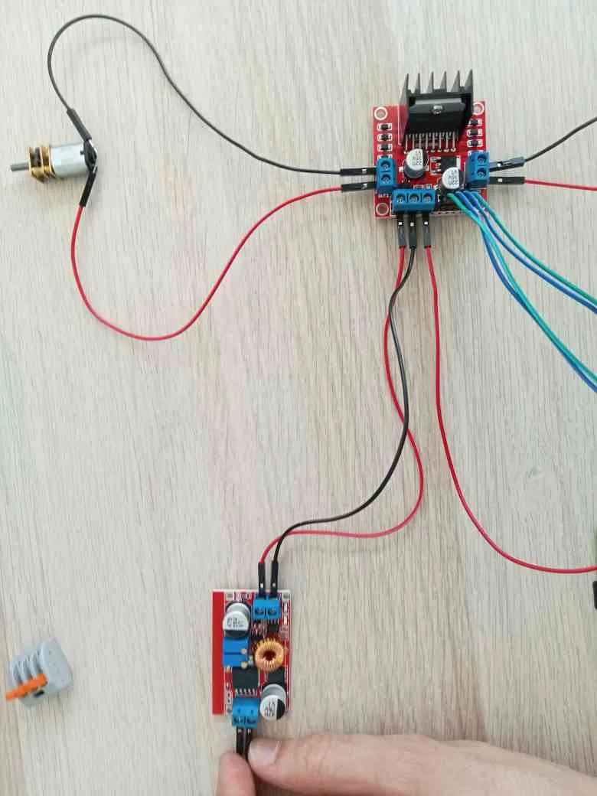
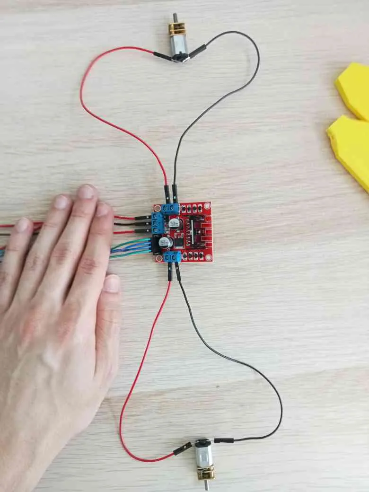
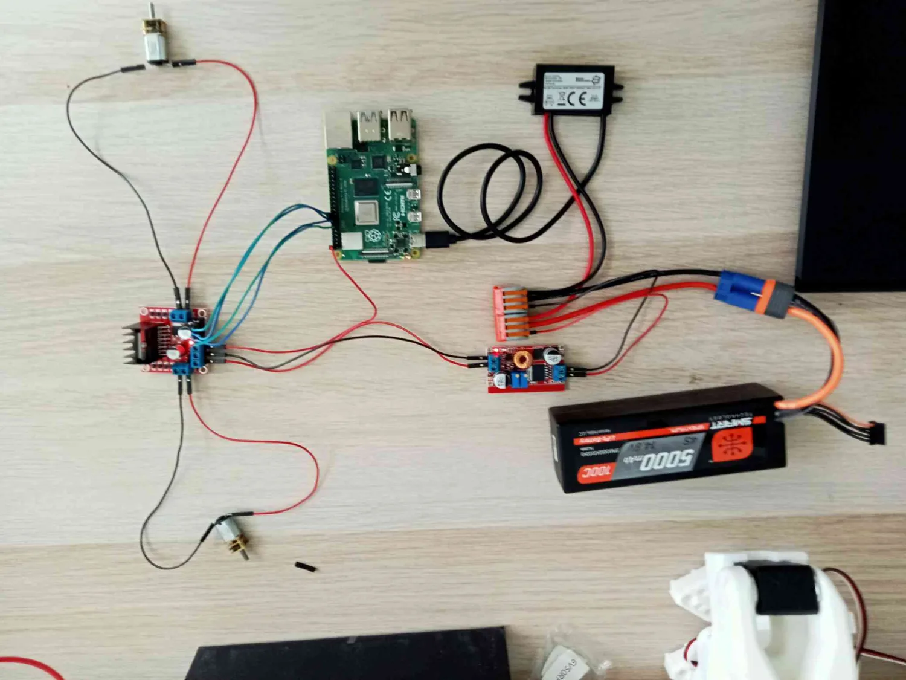

# Wiring of the tank

#### Table of contents

**[readme backlink](../README.md)**

# Sommaire

- **[Composants](#composants)**
- **[Câblage](#câblage)**
- **[Configuration du Raspberry Pi](#configuration-du-raspberry-pi)**

## Components
| Components | Quantity |
|-----------|----------|
| Raspberry Pi 4 Model B | x1 |
| SD card | x1 |
| Battery 14.8V - 5000 mAh | x1 |
| Electric motor 3 V/ 6 V/ 12 V | x2 |
| Voltage regulator | x2 |
| Converter | x1 |
| Module L298N | x2 |
| Connecting wires | As required |
| IC5 to cable adapter | x1 |
| 3D printing filament | As required |

## Wiring
### Step 1 : Preparing the power supply

Prepare the wiring to connect the battery to the rest of the circuit.

> Do not plug in the battery for now.

### Step 2 : Supply connection

Connect the regulator and the converter to the adapter, then connect the converter to the Raspberry Pi.

### Step 3 : Connection of the Raspberry Pi to the L298N modules

Connect the Raspberry Pi to the motor control module.

### Step 4 : Connexion des régulateurs

Connect the regulator to module L298N.

### Step 5 : Connecting the motors

Connect the motors to module L298N.

### Final result

Le montage complet doit ressembler au schéma suivant :

## Setup of the raspberry

- See the documentation **[de Raspberry](https://www.raspberrypi.com/documentation/computers/getting-started.html)**
> System user used in this project: `brav-tek`